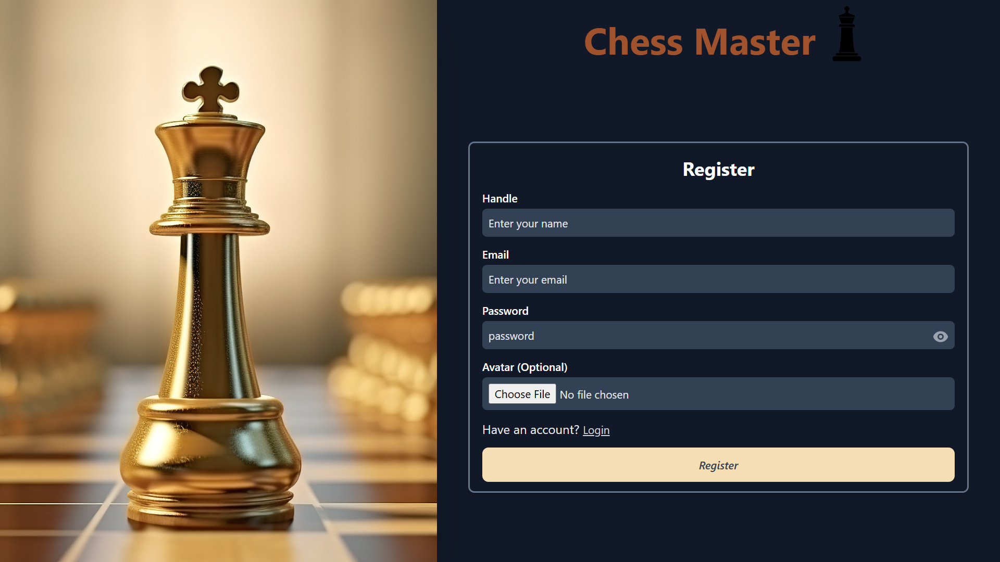
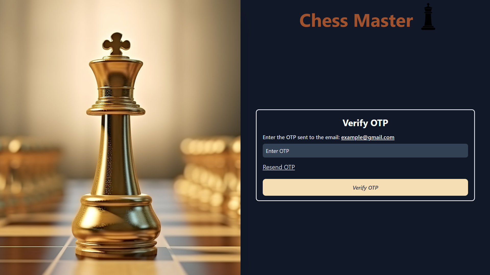
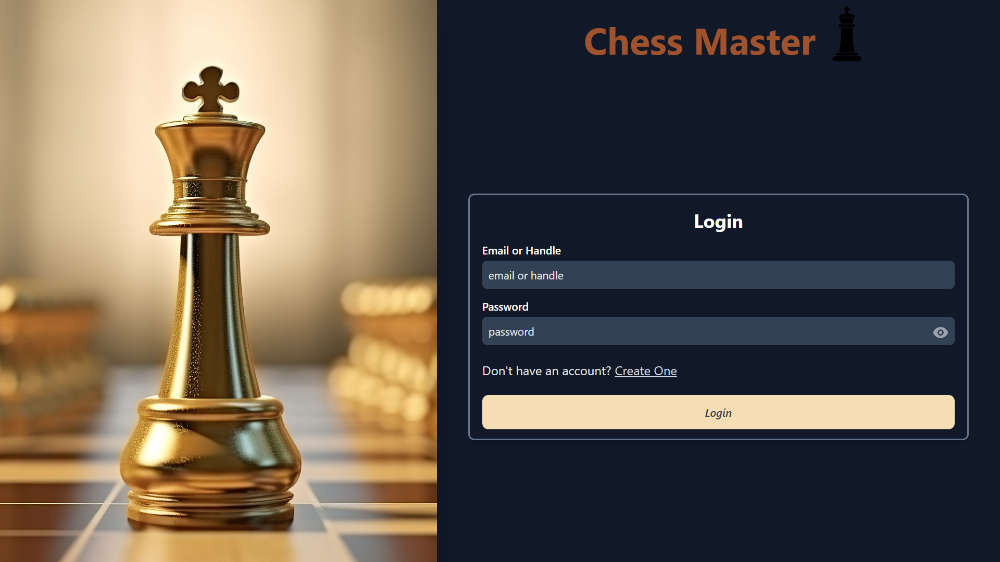
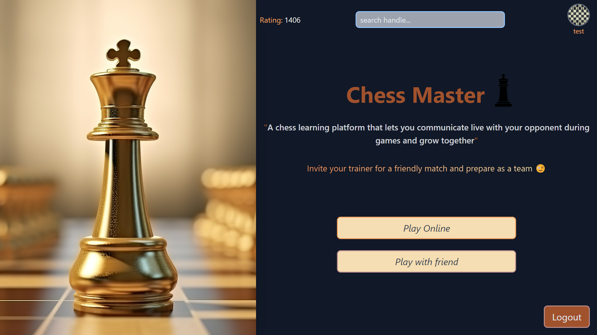
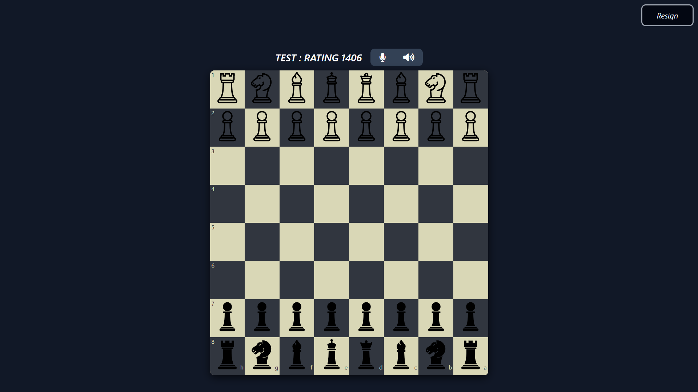
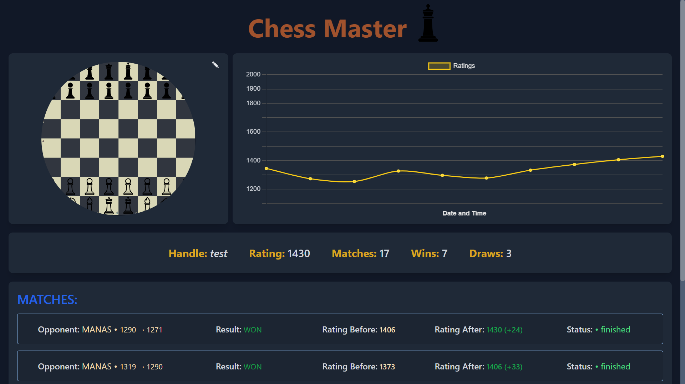
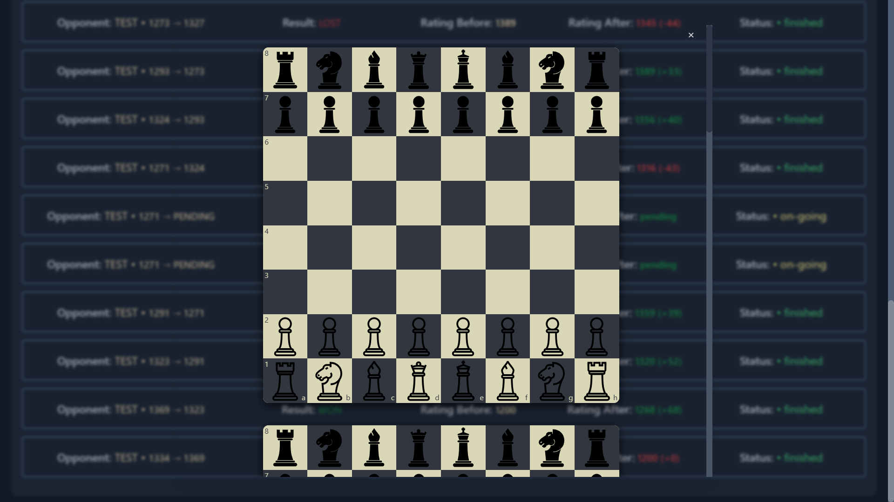
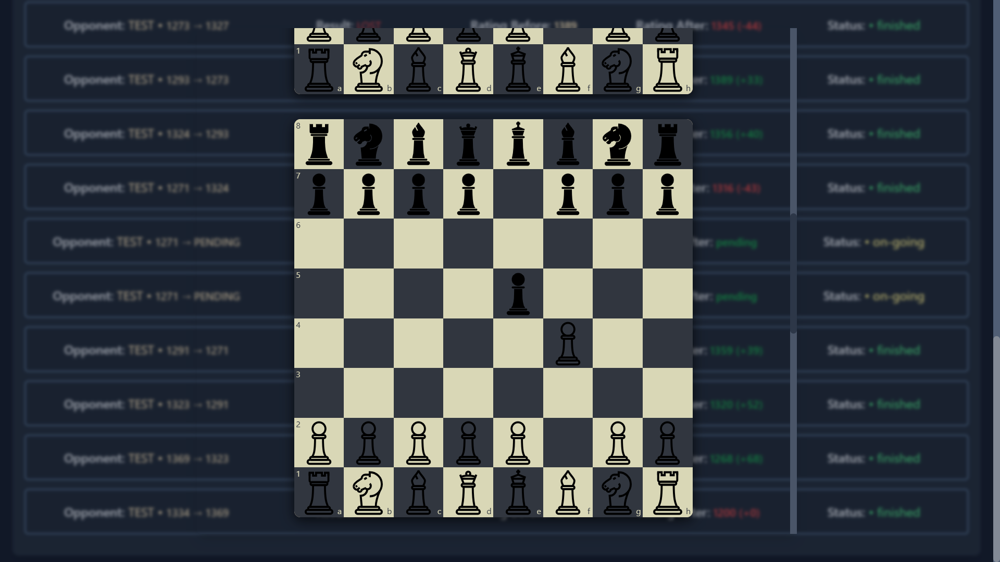

# Chess Master - A Chess Learning Platform

## About Chess Master
**Chess Master** is a platform built for chess enthusiasts who want to improve their skills and connect with others while playing. It’s not just about winning—it’s about growing together.  
</br>

## Video demo
<table>
  <tr>
    <td>
      <video width="320" height="240" controls>
        <source src="https://drive.google.com/file/d/1n6Aadp1Y-wEymJk1U8X3iR4U4Uu_YYno/view" type="video/mp4">
        Your browser does not support the video tag.
      </video>
    </td>
  </tr>
</table>

**Website Link**: &nbsp;[https://chessmaster-manas.vercel.app/](https://chessmaster-manas.vercel.app/)
</br>
</br>
**Backend Repository**: &nbsp;[https://github.com/manas-agarwal16/Chess-backend](https://github.com/manas-agarwal16/Chess-backend)

## Purpose
Chess is more than just a game; it’s a journey of mastering patterns, strategies, and problem-solving. But what truly accelerates improvement is sharing ideas, discussing moves, and learning from one another. That’s where Chess Master comes in. We let you communicate live with your opponent during games, so you can exchange thoughts, share strategies, and support each other. Whether you're playing a friendly match or inviting your trainer for a game, Chess Master brings you closer to your goals as a team.

## Tech Stack
### Frontend Tech Stack
<div style="display: flex; flex-wrap: wrap; gap: 20px;">
  &nbsp;&nbsp;&nbsp;
  
  &nbsp;&nbsp;&nbsp;&nbsp;&nbsp;&nbsp;&nbsp;&nbsp;&nbsp;&nbsp;
  
  &nbsp;&nbsp;&nbsp;&nbsp;&nbsp;&nbsp;&nbsp;&nbsp;&nbsp;&nbsp;&nbsp;&nbsp;&nbsp;&nbsp;&nbsp;
  
  &nbsp;&nbsp;&nbsp;&nbsp;&nbsp;&nbsp;&nbsp;
  
</div>
<div style="display: flex; flex-wrap: wrap; gap: 20px;">
 <pre>ReactJS    Redux-Toolkit    TailwindCSS    WebRTC</pre>
</div>

### Backend Tech Stack
<div style="display: flex; flex-wrap: wrap;">
  &nbsp;&nbsp;
  
  &nbsp;&nbsp;&nbsp;&nbsp;&nbsp;&nbsp;&nbsp;
  
  &nbsp;&nbsp;&nbsp;&nbsp;&nbsp;&nbsp;&nbsp;&nbsp;&nbsp;&nbsp;&nbsp;&nbsp;
  
  &nbsp;&nbsp;&nbsp;&nbsp;&nbsp;&nbsp;&nbsp;&nbsp;&nbsp;&nbsp;&nbsp;
  
</div>
<div style="display: flex; flex-wrap: wrap; gap: 20px;">
  <pre>NodeJS    PostgreSQL    SequelizeORM    Socket.IO</pre>
</div>


## Screenshots
<table>
  <tr>
    <td></td>
    <td></td>
    <td></td>
  </tr>
</table>

## Features
1. Play Online - Chess Master helps you find the perfect opponent with similar ratings, so every game feels challenging and rewarding.
2. Play with Friend - We also give you the option to connect with any of your friends for a fun and friendly competition.

<table>
  <tr>
  <td>  </td>
  <td> </td>
  </tr>
</table>

3. Tracks your progress - Chess Master keeps track of your rating changes and past games, helping you analyze your best moves and mistakes. Learn from every match and improve with real insights.

<table>
  <tr>
    <td> </td>
    <td></td>
    <td></td>
  </tr>
</table>

## Installation

To run the application, you need to have node installed on your machine. If you don't have it installed, you can follow the instructions [here](https://nodejs.org/en/download) to install it.

1. Clone the repository  
   </br>
   ```sh
   git clone https://github.com/manas-agarwal16/Chess-frontend.git
   ```
2. Navigate to the project directory:  
   </br>
   ```sh
   cd Chess-frontend
   ```
3. Install NPM packages  
   </br>
   ```sh
   npm install
   ```
4. Run the Application  
   </br>
   ```js
   npm run dev
   ```

## Contributing
Contributions to Chess Master are welcome! If you encounter any issues or have suggestions for improvements, please feel free to open an issue or submit a pull request.
