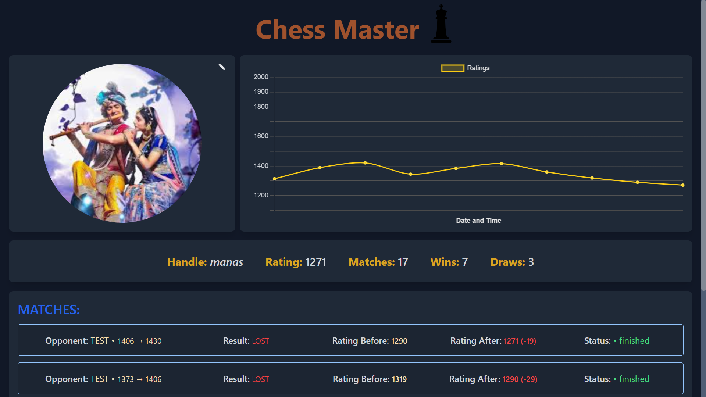

# Chess Master - A Chess Learning Playform

## About Chess Master
**Chess Master** is a platform built for chess enthusiasts who want to improve their skills and connect with others while playing. It’s not just about winning—it’s about growing together.

### Purpose
Chess is more than just a game; it’s a journey of mastering patterns, strategies, and problem-solving. But what truly accelerates improvement is sharing ideas, discussing moves, and learning from one another. That’s where Chess Master comes in. We let you communicate live with your opponent during games, so you can exchange thoughts, share strategies, and support each other. Whether you're playing a friendly match with a friend or inviting your trainer for a game, Chess Master brings you closer to your goals as a team.

## Tech Stack
***ReactJS NodeJS PostgresSQL SequelizeORM Socket.io WebRTC***
# Tech Stack

## ScreenShot
<table>
  <tr>
    <td></td>
    <td></td>
    <td></td>
  </tr>
</table>

# Features
1. Play Online - Chess Master helps you find the perfect opponent with similar ratings, so every game feels challenging and rewarding.
2. Play with Friend - We also give you the option to connect with any of your friends for a fun and friendly competition.

<table>
  <tr>
  <td>  </td>
  <td> </td>
  </tr>
</table>

3. Tracks your progress - Chess Master keeps track of your rating changes and past games, helping you analyze your best moves and mistakes. Learn from every match and improve with real insights.

<table>
  <tr>
    <td> </td>
    <td></td>
    <td></td>
  </tr>
</table>
